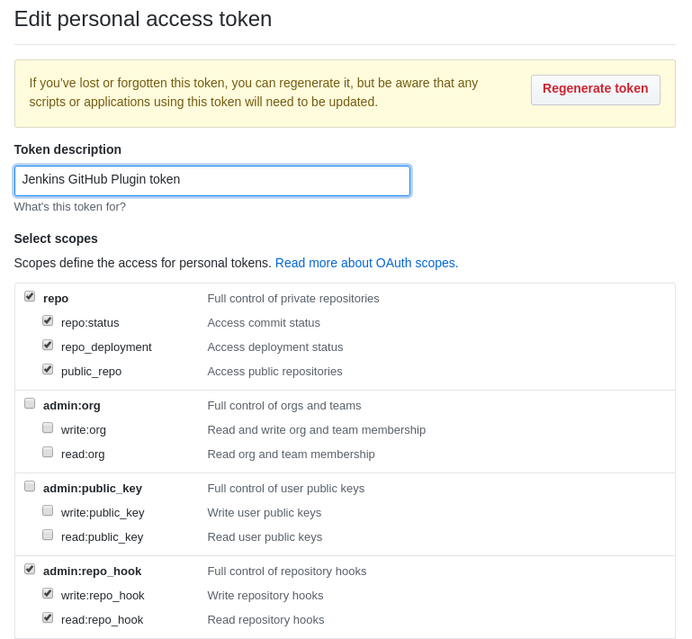

# KubeVirt-CI

Ansible based description of the KubeVirt CI environment for functional tests.
The Ansible roles here allow to re-crate and scale the Jenkins CI environment
used.

## Prepare your Github Project for Jenkins

The following steps **1** and **2** give your Jenkins server the permissions to
add comments to your Pull Request and to change the build status. Step **3**
allow your Jenkins server, to be notified by Github, if there is new code to
test. Independently of these steps, periodically polling a Github repository
for changes will always work.

1. create an access token with the following permissions, to allow your Jenkins
   server to update the PR states.



2. add your Bot to your github project.
3. register the Jenkins callback URL in your github project

 * Fill in your callback URL (e.g. `http://myjenkins.com:1234/ghprbhook/`)
 * Content-type should be `application/x-www-form-urlencoded`
 * Add a secret
 * Enable `Push`, `Pull request`, `Issue comment` notifications

## Prepare your Github Project for Prow

1. create an access token or use the one you created above. Prow needs the
   `public_repo` permission.
2. register the Prow callback URL in your github project

 * Fill in your callback URL (e.g. `https://prow.myopenshift.com/hook/`)
 * Content-type should be `application/json`
 * Create a secret with `openssl rand -hex 20` and set it on the webhook
 * Enable all notifications

Note that the included route for prow hooks will be exposed via `https`.

## Prepare your Ansible Variables

Create a file `group_vars/all/main.yml` based on

```
---
jenkinsUser: "jenkins"
jenkinsPass: "mypwd"
master: "http://my.jenkins.com:8080"
slaveSlots: 1
githubSecret: ""
githubCallbackUrl: "http://my.jenkins.com:8080"
githubToken: "453f86e8a6c9eed45789c689089e1eb2w9x2fda3"
githubRepo: "rmohr/kubevirt"
storeSshUser: "fas-user"
storeSshUrl: "fedoraproject.org"
storeSshRemoteDir: "public_html/jenkins"
storeReportUrl: "https://fas-user.fedorapeople.org/jenkins"
prowUrl: "deck-prow.e8ca.engint.openshiftapps.com" # without the /hook subpath
prowNamespace: "prow"
prowHmac: "e4a61a12b5cae91dca3b8c1a576c735fe971110f" # the webhook secret generated
```

There you can fill in you token, your secret and the Jenkins callback URL.

## Scaling

To add new workers, a client role exists. It uses the Jenkins Swarm plugin to
attach it to the Jenkins master.

## Run the Playbook

Add your master and your clients to the `hosts` file:

```
[jenkins-master]
master ansible_host=my.jenkins.com ansible_user=root

[jenkins-slaves]
slave0 ansible_host=slave0.my.jenkins.com ansible_user=root labels="windows test1"
slave1 ansible_host=slave1.my.jenkins.com ansible_user=root

[prow]
localhost ansible_connection=local
```

The `[jenkins-master]` itself has no executors. It will not run any jobs. If you want to
build also on master, it is possible to add the master to the
`[jenkins-slaves]` section. Then the swarm plugin will register the master node
as a slave too. Optionally it is possible to use the `labels` variable to
assign labels to jenkins nodes. In the example above slave0 would get the
labels `windows` and `test1` attached. `[prow]` will use your local openshift
credentials and deploy prow on the configured cluster.

Provision your machines:

```
ansible-playbook -i hosts ci.yaml
```

## KubeVirt CI Landscape Specifics

### Beaker Role

There exists an additional `beaker` role. It is not generalized, and allows us
in all our beaker managed servers, to increase the LVM volumes to the maximum
available size. The resulting extra LVM volume, is then used as the default
storage location for all VM images.

To make use of that role, adjust your `hosts` file and add all beaker managed
servers to a `beaker` section:

```
[beaker]
slave0 ansible_host=slave0.my.jenkins.com ansible_user=root
slave1 ansible_host=slave1.my.jenkins.com ansible_user=root
```

### Store Role

Our CI infrastructure is not public accessible. Therefore we publish our build
logs separately. The `store` role, can be used to use a fedorapeople account,
to publish the console logs. The PR status message link, will point there.

Use the four variables

```
storeSshUser: "fas-user"
storeSshUrl: "fedoraproject.org"
storeSshRemoteDir: "public_html/jenkins"
storeReportUrl: "https://fas-user.fedorapeople.org/"
```

in `group_vars/all/main.yml` to configure your account, and add the
fedorapeople server to your hosts file:

```
[store]
store0 ansible_host=fedorapeople.org ansible_user=fas-user
```

### Prow Role

It deploys the main prow components and related configs. In the case of prow,
we don't config templates per repo. Instead we have fully configs inside
`prow/files`:

 * `config.yaml`: Contains all prow jobs (not used right now)
 * `plugins.yaml`: Contains all enabled github bots per repo (again, not templatized, instead the full kubevirt-org config)
 * `labels.yaml`: Labels which are used in `kubevirt/kubevirt`. They will be synchronized twice a day with `kubevirt/kubevirt`

## Testing the CI infrastructure

To test changes in this setup, an extra Vagrant setup exists in this repository. To
provision a master, a slave and a store with Vagrant, do the following:

```bash
mkdir -p group_vars/all/
cat >group_vars/all/main.yml <<EOL
jenkinsUser: "vagrant"
jenkinsPass: "vagrant"
master: "http://192.168.201.2:8080"
slaveSlots: 1
githubSecret: ""
githubCallbackUrl: "http://my.jenkins.com:8080"
githubToken: "453f86e8a6c9eed45789c689089e1eb2w9x2fda3"
githubRepo: "kubevirt/kubevirt"
storeSshUser: "vagrant"
storeSshUrl: "192.168.201.4"
storeSshRemoteDir: "public_html/jenkins"
storeReportUrl: "http://192.168.201.4/jenkins"
targets:
  - vagrant-dev
  - vagrant-release
EOL
vagrant up
```

This will provision a master and a slave. The master Jenkins instance can be
reached at `http://192.168.201.2:8080` after the Ansible Playbooks are done.
Credentials are `vagrant:vagrant` To re-run the Ansible Playbooks after a
change, it is sufficient to just run `vagrant provision`. So no need to destroy
the whole machines, if you don't want a full test run.

The provisioned VMs, will periodically poll the `kubevirt/kubevirt` repository
and try to run the functional tests. Since the token is not valid, it will not
update the KubeVirt repository. Nested virtualization can be slow, don't expect
too much from it.

### How to share secrets?

There is an `encrypt.sh` script include. For instance to share the needed
secrets with the user `nobody`, us the public key of the user and run:

```bash
$ ./encrypt.sh ~/.ssh/nobody.pub nobody
Adding the following files:

  secrets/
  secrets/group_vars/
  secrets/group_vars/all/
  secrets/group_vars/all/main.yml
  secrets/inventory
  secrets/id_rsa_jenkins_master.pub
  secrets/id_rsa_jenkins_master

Created nobody.tar.enc and nobody.key.enc
```

The receiver can decrypt the aes key via her public key and then use the aes
key to decrypt the tar file.
